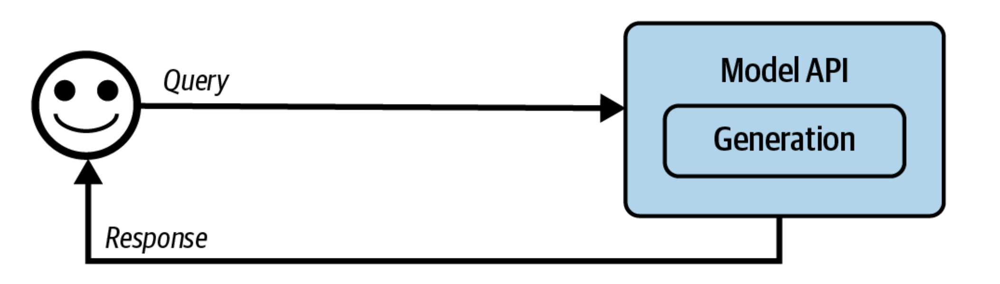
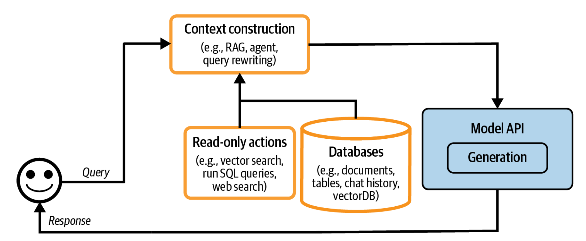
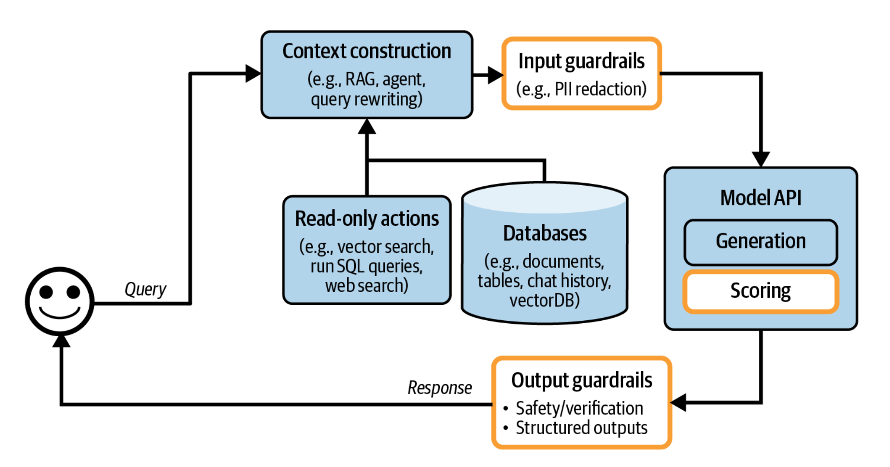
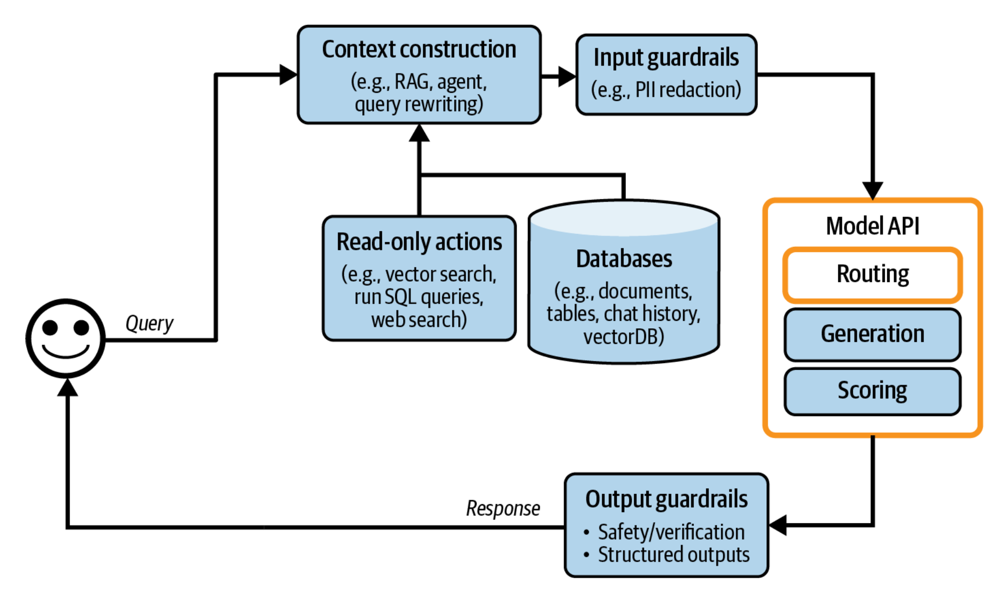
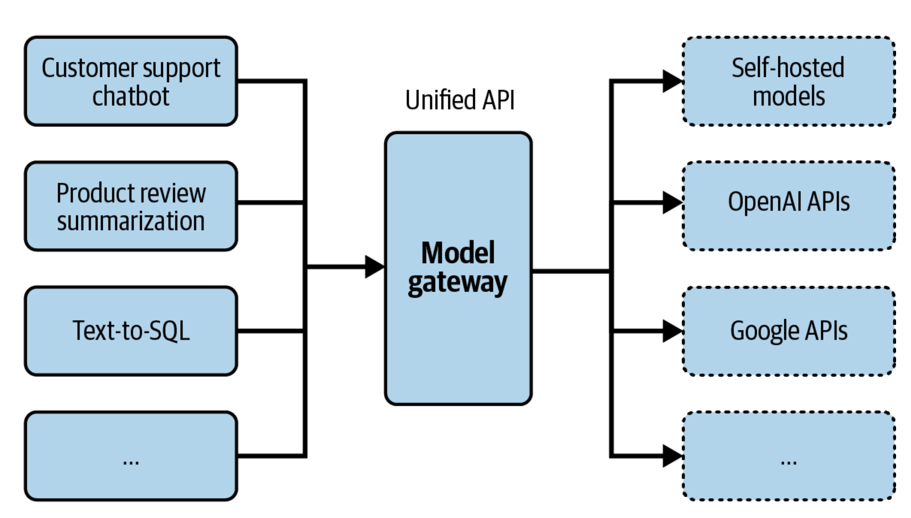
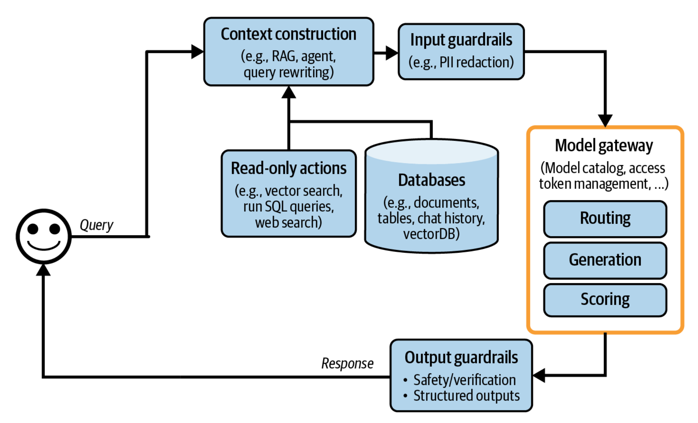
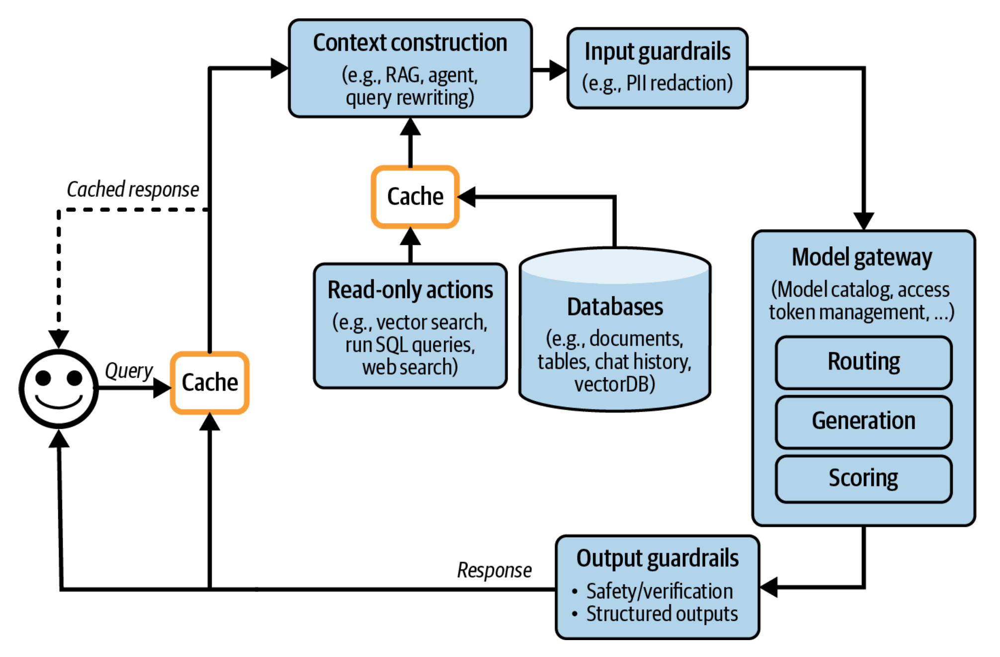
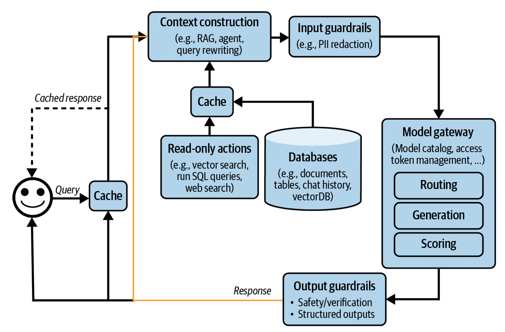
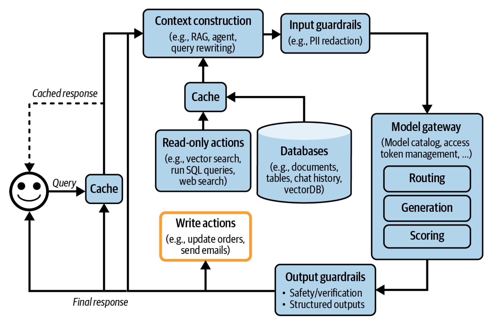

### Incremental Architecture Development

**The Incremental Architecture Philosophy**

- Start with the simplest possible architecture: Query → Model API → Response
- Add components progressively as specific needs arise, not all at once

  
- The 5-step progression commonly seen in production:
    1. **Context Construction** - Give models access to external data (RAG, databases, APIs)
    2. **Guardrails** - Protect against PII leaks and prompt attacks
    3. **Router & Gateway** - Manage multiple models efficiently
    4. **Caching** - Reduce latency and cost
    5. **Agent Patterns** - Enable loops, parallel execution, and write actions

> Most AI applications share common building blocks despite diverse use cases. Understanding this framework helps you avoid reinventing the wheel.

---

### Component Modularity and Flexibility

**Component Flexibility in Architecture**

- There's no single "correct" placement for components
- Example: `Guardrails` can live in:
    - The inference service
    - The model gateway
    - As a standalone component
- Choose based on your specific needs: latency requirements, complexity tolerance, team structure

> Don't overthink component placement initially. Start simple and reorganize as patterns emerge.

---

### Capability-Complexity Trade-offs

**The Capability-Complexity Trade-off**

- Every component you add is a double-edged sword:
    - ✅ Increases capability (can do more)
    - ✅ Increases safety (better protections)
    - ✅ Increases speed (through optimization)
    - ❌ Increases complexity (harder to understand)
    - ❌ Introduces new failure modes (more things can break)

**For Example:**

- Adding caching reduces latency but introduces risk of data leaks (caching user-specific data as generic queries)
- Adding write actions enables automation but exposes system to catastrophic errors (unauthorized bank transfers)

**Decision Framework:** Only add a component when the benefit clearly outweighs the added complexity for YOUR specific use case.

---

### Observability and Monitoring Essentials

**Observability Must Be Built-In, Not Bolted-On**

- **Monitoring** = Tracking outputs to detect problems
- **Observability** = Designing the system so internal states can be inferred from external outputs

**Three Critical Metrics:**

1. **MTTD (Mean Time to Detection)** - How fast you catch problems
2. **MTTR (Mean Time to Response)** - How fast you fix them
3. **CFR (Change Failure Rate)** - % of deployments that break things

> If you don't know your CFR, your system isn't observable enough - redesign required.

---

### Failure-Driven Metrics Design

**Failure-First Metrics Design**

The process is NOT "what metrics should I track?" It's:

1. **Identify failure modes** - What can go wrong? (hallucinations, PII leaks, format errors, toxic outputs)
2. **Design metrics around failures** - Track what helps detect these specific failures
3. **Create traces** - Ensure you can follow a request through the entire system to pinpoint where it failed

**Example:**
- Don't want hallucinations? → Track "can output be inferred from context?"
- Don't want cost overruns? → Track input/output tokens per request + cache hit rate

> Traces should show the complete timeline: query → context construction → guardrails → model → output, with timing and cost per step.

---

### Foundation Model-Specific Failures

**New Failure Modes Unique to Foundation Models**

**Quality Failures:**
- Malformatted outputs (invalid JSON when you expect JSON)
- Hallucinations (factually wrong information)
- Generally poor quality (bad writing, irrelevant responses)

**Security Failures:**
- Toxic content (racist, sexual, illegal activities)
- PII leakage (exposing private information)
- Remote code execution (malicious tool calls)
- Brand risk (mischaracterizing your company)

**Why Traditional ML Metrics Aren't Enough:** Foundation models are open-ended, not classification tasks. You need AI judges, factual consistency checks, and content safety scanners - not just accuracy/precision/recall.

---

### Conversational Feedback Paradigm

**Conversational Feedback is a Game-Changer**

**Three Types of Feedback:**

1. **Explicit Feedback** (traditional)
    - Thumbs up/down, star ratings
    - Easier to interpret but sparse (users don't want to click)
    - Suffers from bias (unhappy users complain more)
      
2. **Implicit Feedback** (behaviour-based)
    - Product purchases, time spent, regeneration
    - More abundant but noisier
    - Interpretation depends on context
      
3. **Conversational Feedback** (NEW with foundation models)
    - Natural language corrections: "No, I meant..."
    - Early termination of responses
    - Error corrections and rephrasing
    - Sentiment shifts (angry → happy = problem solved)
    - Model refusal patterns ("As an AI, I can't...")

**Why It Matters:** The conversational interface makes feedback easier for users (just talk naturally) but harder for engineers (must extract signals from natural language).

**Use Cases:**
- **Evaluation** - Monitor how well the app performs
- **Development** - Train future model iterations
- **Personalization** - Adapt to individual user preferences

---

### Engineering-Product Role Convergence

**AI Engineers Must Now Care About Feedback Design**

**The Shift:**
- Traditional ML: Engineers build models, product teams handle feedback
- AI Engineering: Feedback IS data, and data is the competitive advantage

**Why This Changed:**
- User feedback = proprietary training data
- Companies that launch early and collect feedback create a **data flywheel**:
    - More users → More feedback → Better models → More users → ...
- Competitors can't catch up because they don't have your user data

> **Real Example:** A startup that ships fast and attracts users can continuously improve models with user data, making it nearly impossible for late competitors to match quality even with better initial technology.

---

### User Feedback as Competitive Moat

**User Feedback = Proprietary Competitive Moat**

**Three Competitive Advantages in AI:**

1. **Technology** - Foundation models make this similar across companies
2. **Distribution** - Big tech likely wins here
3. **Data** - THIS is where startups can win

**The Data Advantage:**
- User feedback is perfectly aligned with your task (matching your distribution)
- Application data beats scraped public data
- Early market entry + fast feedback collection = sustainable moat

**Critical Constraint:** User feedback IS user data. Respect privacy, require consent, be transparent about usage.

---

### Data Flywheel and Continuous Improvement

**The Convergence of Engineering and Product**

**What Changed:**
- Traditional ML: Build model, hand off to product team
  
- AI Engineering: Engineer must understand:
    - How users interact with the system
    - What feedback signals matter
    - How to design for feedback collection
    - User experience trade-offs (latency vs safety)

**Why Data Flywheel Matters:**
- It's not just about having good models
- It's about having a **system** that continuously improves from user interactions
- Product experience determines whether users stay and provide feedback

> **Example:** A chatbot with mediocre responses but excellent feedback collection can eventually outperform a chatbot with great initial responses but poor feedback systems.

----

### System-Level Problem Solving

**Think System-Level, Not Component-Level**

**What This Means:**
- A single problem might need multiple components working together
- OR different components could solve it independently
- Solutions require understanding how components interact

**Example:**
- **Problem:** Preventing hallucinations
- **System-level solutions:**
    - Context construction (give model better info)
    - Output guardrails (catch hallucinations)
    - Model routing (use more reliable model for factual queries)
    - Feedback collection (learn what triggers hallucinations)
    - Caching (reuse verified good responses)

> **Anti-pattern:** Trying to solve everything with "a better prompt" or "a better model" when the real issue is architectural.

---

### Holistic Safety and System Design

**Safety Requires Holistic System Understanding**

**Critical Safety Concepts:**

1. **Guardrails Must Be Multi-Layered**
    - Input guardrails: Prevent PII leaks to external APIs, block prompt attacks
    - Output guardrails: Catch toxic content, verify factual consistency
    - Risks can be mitigated but NEVER fully eliminated
      
2. **Write Actions Are High-Risk**
    - Enable powerful automation (send emails, transfer money, update databases)
    - Require extreme care: unreliable AI + write permissions = potential disaster
    - Must have: verification, rollback, comprehensive logging
      
3. **Observability Enables Safety**
    - Must trace requests end-to-end
    - Must detect when guardrails trigger
    - Must understand failure modes BEFORE they happen

**Real Risk Example:** Samsung employee accidentally leaked company secrets by pasting proprietary code into ChatGPT. This is WHY input guardrails matter.

---

## Notes

### **Context Construction = Feature Engineering for Foundation Models**

- Just like ML models need good features, foundation models need good context
- Models hallucinate when context is insufficient (they guess using unreliable internal knowledge)
- Tools for context: RAG (retrieval), SQL queries, web search APIs, custom business data

### **Router Economics**

- Don't use one expensive model for everything
- Route simple queries to cheap models, complex to expensive ones
- Can save significant costs while maintaining quality
- Routers should be fast and cheap (small models like BERT, not GPT-4)

### **Caching Security**

- Improper caching causes data leaks
- Never cache user-specific queries as generic
- Example: Caching "return policy" answer with User A's membership details, then showing it to User B

### **Feedback Interpretation Depends on Context**

- Long conversations in AI companions = good (user engaged)
- Long conversations in customer support = bad (inefficient bot)
- Regeneration for creative tasks = neutral (exploring options)
- Regeneration for factual queries = negative (first response inadequate)

### **Sycophancy Risk**

- Training models on user feedback can teach them to tell users what they WANT to hear, not what's TRUE
- Can amplify biases (cat photos example → becomes "cat haven")
- Must balance user preference with accuracy and safety

> Building production AI applications is about understanding systems, not just models. Success requires balancing capability with complexity, designing for observability from day one, and treating user feedback as both a valuable asset and a potential liability requiring careful ethical handling.